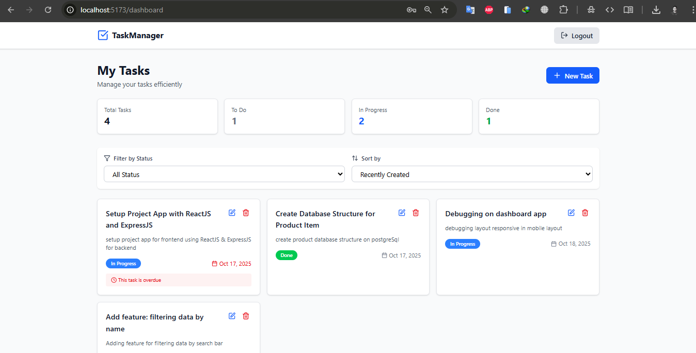

# Task Management App

A simple **Task Management Application** built with **React**, **TailwindCSS**, and **ExpressJS**.  
This app provides core features for managing tasks efficiently, including authentication, task operations, and real-time feedback.

---

## Features

- User Authentication (Login / Register)
- CRUD Operations for Tasks
- Filter Tasks by Status
- Sort Tasks by Deadline or Creation Date
- Responsive UI Design
- Real-Time Notifications

---

## Installation & Setup

### Backend Setup

1. **Database Configuration**

   - Import the provided `db.sql` file into your MySQL database.
   - Create a `.env` file in the backend root directory using the provided `.env.example` as a reference.  
     Example:
     ```env
     DB_HOST=localhost
     DB_USER=root
     DB_PASSWORD=
     DB_NAME=task_management
     JWT_SECRET=your_secret_key
     ```

2. **Install Dependencies**

   ```bash
   npm install
   ```

3. **Run the Server**

   ```bash
   npm start
   ```

   The backend should now be running at:

   ```
   http://localhost:3000
   ```

   You should see:

   ```
   Server is running at http://localhost:3000
   Database connected!
   ```

---

### Frontend Setup

1. **Install Dependencies**

   ```bash
   npm install
   ```

2. **Create `.env` File**

   ```env
   VITE_API_URL=http://localhost:3000
   ```

3. **Run the Application**

   ```bash
   npm run dev
   ```

   The frontend will run at:

   ```
   http://localhost:5173
   ```

---

## Tech Stack

| Layer        | Technologies                                                         |
| ------------ | -------------------------------------------------------------------- |
| **Frontend** | React 18, Vite, TailwindCSS, Axios, React Router DOM, React Toastify |
| **Backend**  | ExpressJS, bcrypt, cors, dotenv, jsonwebtoken                        |
| **Database** | MySQL                                                                |

---

## Dummy Login Account

Use the following credentials to log in:

| Field        | Value            |
| ------------ | ---------------- |
| **Email**    | `user@gmail.com` |
| **Password** | `user`           |

---

## Database Structure

**Database Name:** `db-tm`

### Table: `users`

| Column       | Type         | Attributes                  | Description                     |
| ------------ | ------------ | --------------------------- | ------------------------------- |
| `user_id`    | INT          | PRIMARY KEY, AUTO_INCREMENT | Unique identifier for each user |
| `name`       | VARCHAR(100) | NOT NULL                    | User's full name                |
| `username`   | VARCHAR(50)  | UNIQUE, NOT NULL            | Username for login              |
| `email`      | VARCHAR(100) | UNIQUE, NOT NULL            | User's email address            |
| `password`   | VARCHAR(255) | NOT NULL                    | Hashed user password            |
| `created_at` | TIMESTAMP    | DEFAULT CURRENT_TIMESTAMP   | Record creation time            |

---

### Table: `tasks`

| Column        | Type                               | Attributes                                            | Description                     |
| ------------- | ---------------------------------- | ----------------------------------------------------- | ------------------------------- |
| `task_id`     | INT                                | PRIMARY KEY, AUTO_INCREMENT                           | Unique identifier for each task |
| `user_id`     | INT                                | FOREIGN KEY (`users.user_id`)                         | Owner of the task               |
| `title`       | VARCHAR(255)                       | NOT NULL                                              | Task title                      |
| `description` | TEXT                               | NULLABLE                                              | Task details                    |
| `status`      | ENUM('To Do','In Progress','Done') | DEFAULT 'To Do'                                       | Current task status             |
| `deadline`    | DATE                               | NULLABLE                                              | Task deadline date              |
| `created_at`  | TIMESTAMP                          | DEFAULT CURRENT_TIMESTAMP                             | Task creation time              |
| `updated_at`  | TIMESTAMP                          | DEFAULT CURRENT_TIMESTAMP ON UPDATE CURRENT_TIMESTAMP | Last modification time          |

---

**Relationships:**

- Each **user** can have multiple **tasks** (`1:N` relationship).
- Deleting a user will automatically delete their associated tasks (`ON DELETE CASCADE`).

---

## Main Interface Screenshot



---

## License

This project is open-source and available under the [MIT License](LICENSE).

---

### Author

Developed by [Aji Dwi](https://github.com/ajidwi02)
